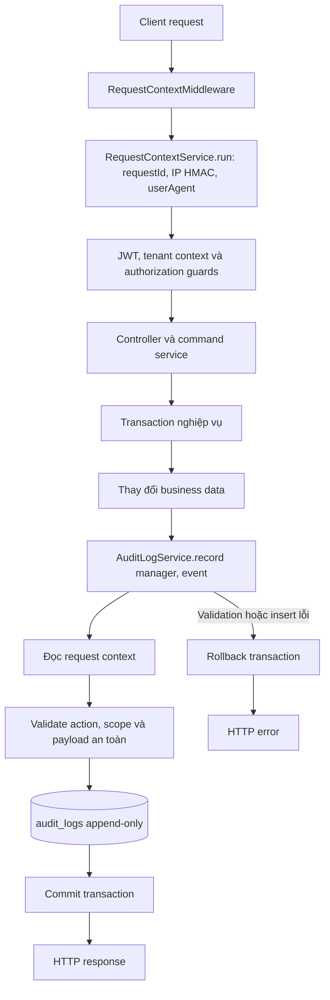

# Audit Log Write Flow

Sơ đồ này mô tả luồng kỹ thuật khi một command nghiệp vụ ghi `AuditLog`. Quy tắc domain, payload được phép, API đọc và retention vẫn theo [audit log contract](../05-audit-log.md).

## Quy tắc triển khai

- Command gọi `AuditLogService.record(manager, event)` bằng chính `EntityManager` của transaction. Thay đổi nghiệp vụ và audit commit hoặc rollback cùng nhau.
- `event` chỉ chứa actor, tenant/branch scope đã xác minh, action, resource và payload theo allowlist. `requestId`, IP HMAC và user agent do `AuditLogService` lấy từ `RequestContextService`.
- Request context chỉ sống trong vòng đời HTTP request. Với job hoặc webhook không có HTTP context, audit service tạo request ID mới và lưu IP/user agent là `null`.
- `audit_logs` không được update hoặc delete; database trigger bảo vệ tính append-only.
