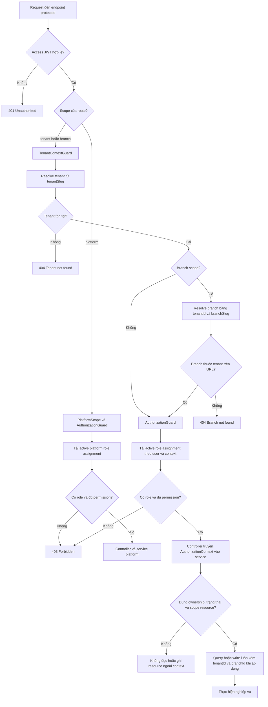

# Authorization Request Flow

Sơ đồ này mô tả luồng authorization hiện có cho một endpoint protected. Nó không thể hiện `Subscription Guard`, vì guard đó chưa được triển khai.

## Cách đọc

- `TenantContextGuard` chỉ xác định tenant/branch mục tiêu từ URL. Nó không kiểm tra quyền của user.
- `AuthorizationGuard` dùng context đã resolve và `userId` trong JWT để kiểm tra active assignment cùng permission. Target tồn tại nhưng user không có scope hoặc thiếu permission trả `403`.
- Service vẫn chịu trách nhiệm kiểm tra ownership/case và chỉ truy vấn trong context đã xác thực. ID từ body chỉ là resource reference, không cấp quyền.

Quy tắc đầy đủ nằm ở [implementation contract](../03-role-workflows.md#108-implementation-contract-cho-scoped-api).
