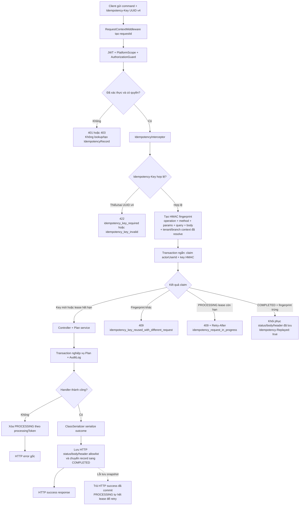
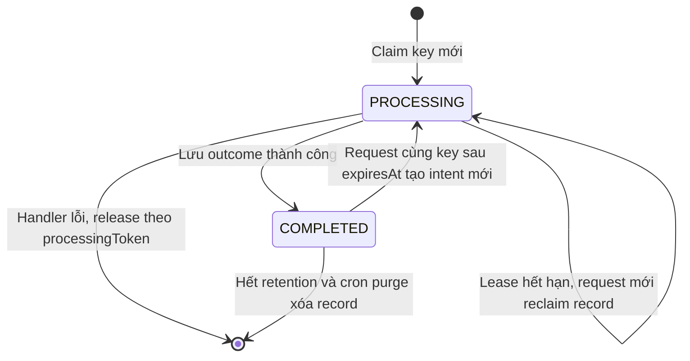

# Idempotency Request Flow

Sơ đồ này mô tả implementation hiện tại của idempotency cho command Plan. Contract đầy đủ và lộ trình rollout nằm tại [09-idempotency-implementation-plan.md](../09-idempotency-implementation-plan.md); API Plan nằm tại [02-platform-admin.md](../02-platform-admin.md).

Hiện chỉ có hai endpoint áp dụng:

- `POST /platform/plans` — `platform.plan.create`
- `PATCH /platform/plans/:planId` — `platform.plan.update`

## Luồng request



## Thứ tự runtime cần giữ

Guard chạy trước interceptor. Vì vậy request chưa đăng nhập hoặc không có quyền nhận `401`/`403` trước khi idempotency lookup, không thể dùng một key cũ để đọc outcome của command mà actor không còn quyền.

Global interceptor được đăng ký theo thứ tự sau:

```text
LoggingInterceptor (ngoài)
  → IdempotencyInterceptor
    → ClassSerializerInterceptor (trong)
```

Kết quả được snapshot sau serialization; logging vẫn ghi cả request replay và outcome cuối. `IdempotencyInterceptor` không mở transaction bao quanh controller hay service.

## Trạng thái `IdempotencyRecord`



`processingToken` là ownership token. `complete` hoặc `release` chỉ tác động nếu token vẫn khớp, nên request cũ không thể hoàn tất/xóa record đã bị request khác reclaim sau lease.

## Quy tắc outcome

| Tình huống | HTTP response | Có chạy mutation mới? |
| --- | --- | --- |
| Thiếu key | `422 idempotency_key_required` | Không |
| Key không phải UUID v4 | `422 idempotency_key_invalid` | Không |
| Cùng actor/key/fingerprint, record `COMPLETED` | Status/body/header snapshot + `Idempotency-Replayed: true` | Không |
| Cùng actor/key, fingerprint khác | `409 idempotency_key_reused_with_different_request` | Không |
| Cùng actor/key, `PROCESSING` còn lease | `409 idempotency_request_in_progress` + `Retry-After` | Không |
| Lease hết hạn | Claim lại rồi chạy command | Có |
| Handler lỗi | HTTP error gốc; record được release | Không commit nếu transaction nghiệp vụ rollback |

Snapshot chỉ giữ `cache-control`, `etag` và `location` nếu controller đặt chúng. Không lưu/replay `X-Request-Id`, `Set-Cookie`, cookie hoặc hop-by-hop header.

## Phạm vi tenant và bảo mật dữ liệu

Unique constraint là `(actor_user_id, idempotency_key_hash)`, không chứa tenant/branch. Tuy nhiên fingerprint chứa scope, tenant ID và branch ID **do server resolve** từ `AuthorizationContext`; tenant/branch do client đưa trong body không được dùng để chọn scope.

Database không có raw `Idempotency-Key` hay raw request body. Record chỉ lưu HMAC của key/fingerprint và body của **HTTP outcome đã hoàn tất** để phục vụ replay.

## Retention

Record `COMPLETED` có `expiresAt = completedAt + 30 ngày`. `IdempotencyRecordPurgeService` chạy bằng Nest Scheduler lúc **03:15 UTC hằng ngày**, chỉ xóa completed record đã quá `expiresAt`. Tác vụ là `DELETE` idempotent, không dùng BullMQ/worker; lỗi được log và sẽ được thử lại ở lần chạy hằng ngày tiếp theo.

Sau retention, cùng key được xem là intent mới. Đây là lý do client không được tái sử dụng key cho command khác trong thời gian key còn hiệu lực.

## Hành vi client

Plan client tạo key với `crypto.randomUUID()` khi người dùng bắt đầu submit intent. Nó giữ lại key khi submit lại payload không đổi hoặc HTTP retry sau refresh token; thay payload, đổi plan hoặc đóng/mở dialog tạo key mới.

## Giới hạn có chủ đích

Đây là best effort, không phải exactly-once. Nếu transaction nghiệp vụ đã commit nhưng process chết hoặc không lưu được outcome trước khi lease kết thúc, cùng key có thể được chạy lại sau lease. Không thêm transaction dùng chung giữa interceptor và business service chỉ để loại bỏ khe hở hiếm này.
