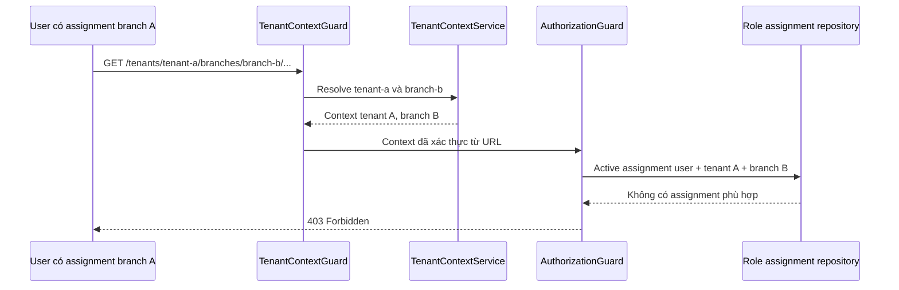
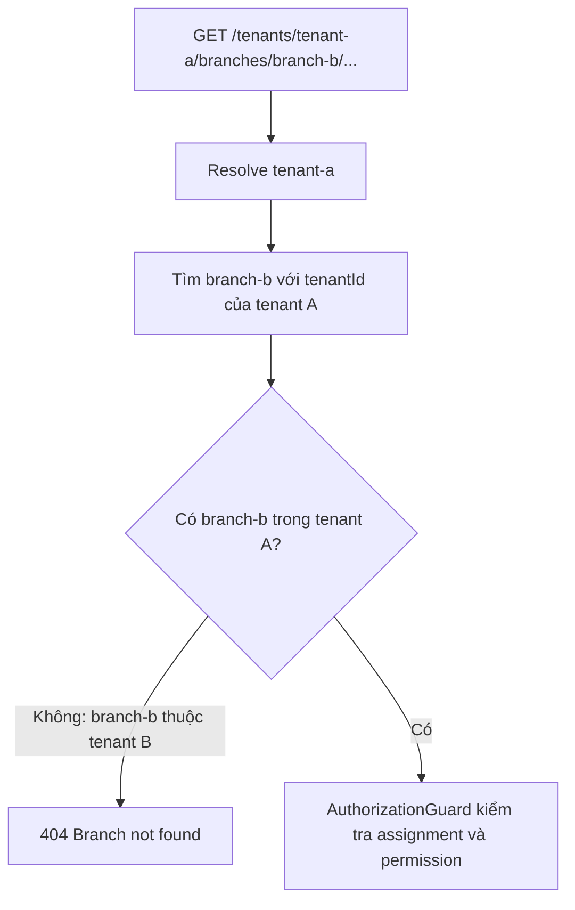
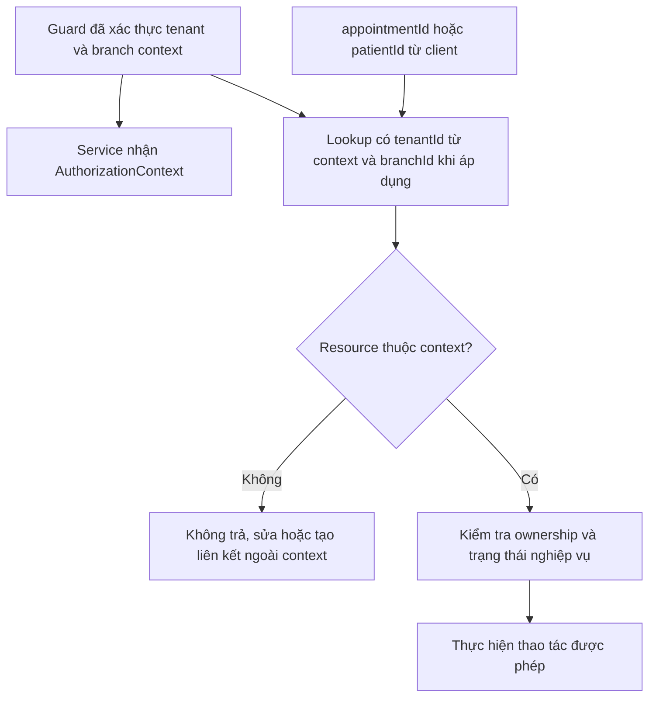

# Tenant–Branch Isolation Flow

Hai sơ đồ dưới đây minh hoạ những điểm chặn truy cập chéo. Chúng dựa trên guard hiện có và các ca trong [authorization guard E2E tests](../../backend/test/authorization-guards.e2e-spec.ts).

## User của branch A gọi URL branch B cùng tenant

`TenantContextGuard` có thể resolve branch B vì branch này hợp lệ trong tenant A. Chỉ `AuthorizationGuard` quyết định user của branch A không có quyền trên branch B.

## URL ghép branch của tenant B vào tenant A

Branch được tìm bằng cặp `(tenantId đã resolve, branchSlug)`, không phải bằng `branchSlug` đơn lẻ. Vì thế branch của tenant B không thể tạo branch context cho tenant A.

## ID resource ngoài context trong body hoặc path

`tenantId`, `branchId`, `tenantSlug` và `branchSlug` trong body/query không được dùng để chọn context hay cấp quyền. Xem [implementation contract](../03-role-workflows.md#108-implementation-contract-cho-scoped-api) để biết quy tắc service đầy đủ.
